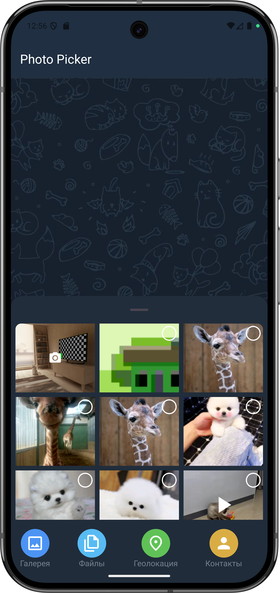
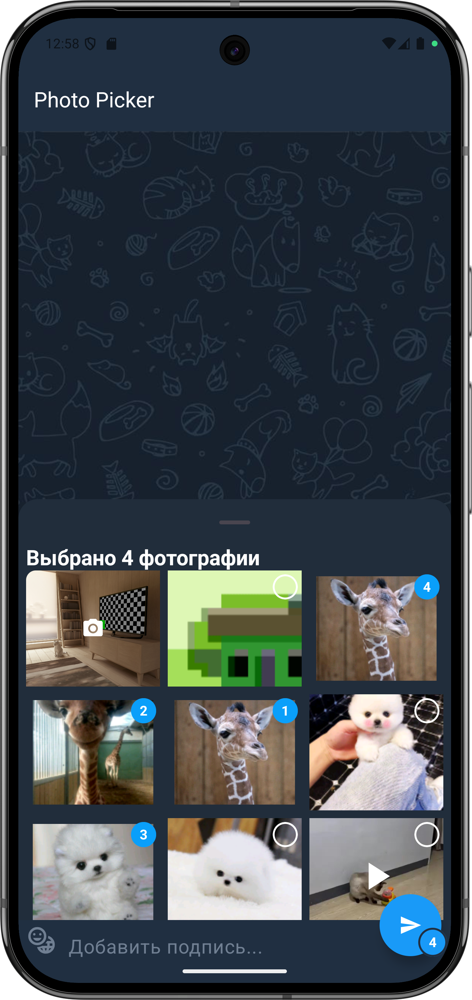
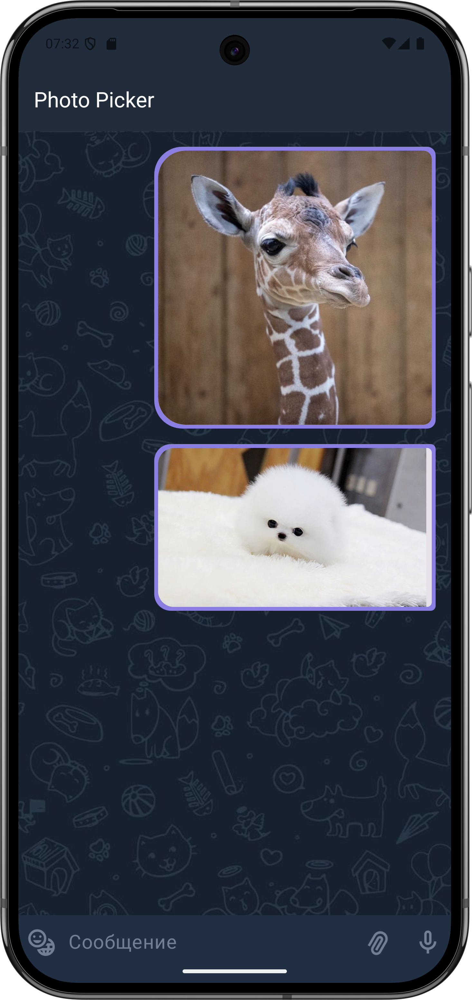
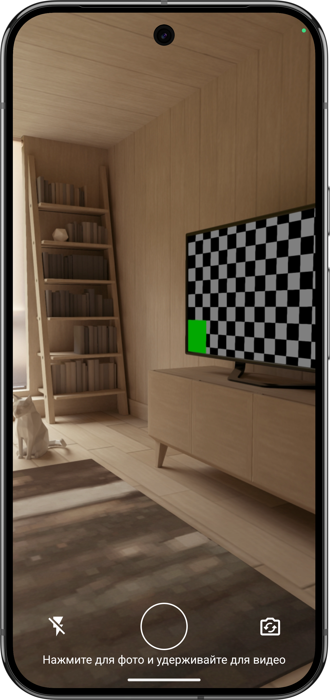

# 📸 TG Photo Picker

> 🎯 **Android приложение для выбора фото и видео в стиле Telegram**

## 🌟 Описание

TG Photo Picker — это современное Android приложение, созданное с использованием Jetpack Compose, которое предоставляет интуитивный интерфейс для выбора фото и видео, имитирующий дизайн медиа-пикера Telegram. 
## ✨ Ключевые особенности
 |Кастомный PhotoPicker |Выбор медиа файлов |
 |---|-----|
  |  |  |
   |Отправка фото |Снимок|
  |  |  |

### 📱 Основной функционал
- 🖼️ **Просмотр медиа**: Удобная сетка для просмотра изображений и видео
- ✅ **Множественный выбор**: Выбор нескольких медиафайлов с чекбоксами
- 👀 **Предварительный просмотр**: Полноэкранный просмотр выбранных медиа
- 🎬 **Поддержка видео**: Воспроизведение видео с элементами управления

### 🎥 Видео возможности
- ▶️ **Воспроизведение**: Полноценное воспроизведение видео с ExoPlayer
- 🖼️ **Миниатюры**: Автоматическая генерация превью для видеофайлов
- 🔄 **Кроссплатформенность**: Поддержка разных версий Android API

### 🔐 Управление разрешениями
- 📱 **Android 13+**: Использует гранулированные разрешения для медиа
- 📱 **Android 12 и ниже**: Совместимость со старыми версиями
- ⚡ **Динамические запросы**: Запрос разрешений в реальном времени 

## 🏗️ Технологический стек

### 🎨 UI & Дизайн
- **Jetpack Compose** - Современный декларативный UI фреймворк
- **Material 3** - Актуальная система дизайна от Google
- **BottomSheetScaffold** - Интерфейс с выдвижным нижним листом 

### 📚 Основные библиотеки
- **ExoPlayer (Media3)** - Мощный медиаплеер для воспроизведения видео
- **Landscapist Coil** - Асинхронная загрузка и кэширование изображений
- **Android MediaStore API** - Доступ к медиафайлам устройства

